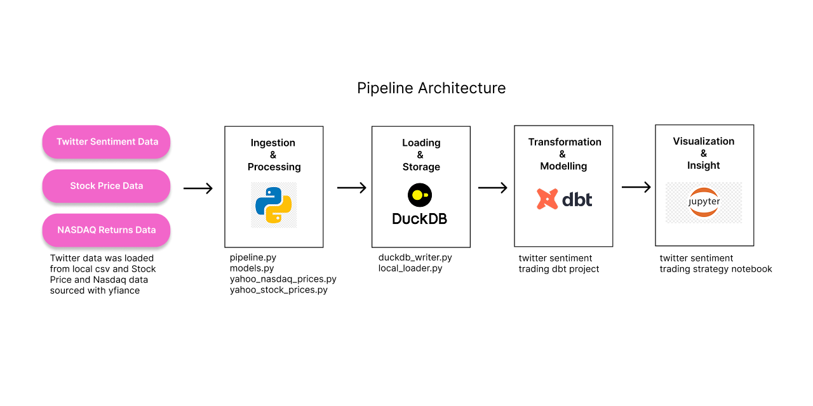
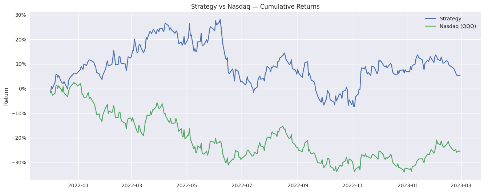

# Twitter Sentiment Trading Strategy  
*A full end‑to‑end data engineering and analytics project using Python, DuckDB, dbt, and Jupyter.*

---

## 📌 Background & Overview

This project explores whether **Twitter engagement sentiment** can be used to construct a profitable equity trading strategy. The workflow integrates:

- **Python ingestion pipelines**  
- **DuckDB** as an analytical storage engine  
- **dbt** for transformations, testing, and modeling  
- **A final Jupyter notebook** for visualization and insights  

The data pipeline:

1. Computes monthly sentiment scores for stocks based on Twitter engagement  
2. Selects the **top 5 stocks** each month  
3. Builds an **equal‑weighted daily portfolio**  
4. Compares performance against the **Nasdaq‑100 ETF (QQQ)**  

---

## 🏗️ Pipeline Structure

Full pipeline architecture:

Ingestion → DuckDB → dbt Staging → dbt Intermediate → dbt Marts → Notebook

### 📥 Ingestion (Python)
- `yahoo_stock_prices.py` — downloads daily OHLCV stock data  
- `yahoo_nasdaq_prices.py` — downloads QQQ benchmark data  
- `twitter_sentiment_ingest.py` — loads validated Twitter sentiment  
- `pipeline.py` — orchestrates the entire ingestion workflow  

### 🗄️ Storage (DuckDB)
All raw and transformed data is stored in:

data/processed/sentiment.duckdb

### 🧱 dbt Transformations
- **Staging models** clean and standardize raw data  
- **Intermediate models** compute sentiment, returns, and portfolio logic  
- **Marts** combine everything into analysis‑ready tables  

Full dbt DAG lineage:

### 📊 Final Output
A Jupyter notebook visualizes:

- Strategy cumulative returns  
- Strategy vs Nasdaq performance  
- Excess returns  

---

## 📊 Insights Summary

The engagement‑ratio strategy demonstrated notable outperformance relative to the Nasdaq benchmark over the period analyzed, with consistently positive cumulative excess returns and a stronger overall trajectory than the index. While these results are encouraging, they should be interpreted with caution. The strategy’s apparent success may be influenced by the specific time window, the characteristics of the selected stocks, and the limitations of the dataset, including the absence of survivorship‑bias‑free constituents and transaction costs. As with any quantitative signal, correlation does not imply causation, and a simple engagement‑based rule is unlikely to remain effective across all market environments. These findings should therefore be viewed as exploratory rather than conclusive, highlighting the need for broader testing and more rigorous validation.

---

## Choice of tools

🦆 DuckDB Integration
DuckDB is used as the analytical storage engine because it is:
• 	Fast
• 	File‑based
• 	Zero‑configuration
• 	Perfect for local analytics projects
All ingestion scripts write directly into DuckDB tables.
dbt then reads from DuckDB using the DuckDB adapter.

🧱 dbt Integration
dbt is the backbone of the transformation layer.
Key Features Used:
- Staging models for clean, typed data
- Intermediate models for business logic
- Marts for final analytical outputs
- Custom tests to validate assumptions
- Documentation via YAML files

Example dbt Models:
- int_equal_weighted_portfolio_returns.sql
- int_nasdaq_returns.sql
- mart_portfolio_vs_nasdaq.sql
- mart_strategy_performance.sql

Example Custom Tests:
- Portfolio returns should not be null after the first row
- Nasdaq returns should not be null after the first row
- Portfolio and Nasdaq dates must align
- Excess return must equal portfolio_return − nasdaq_return
These tests ensure the pipeline is trustworthy and reproducible.

📓 Final Output — Jupyter Notebook
The notebook performs:
- Cumulative return calculations
- Strategy vs benchmark comparison
- Excess return analysis
- Visualizations using Matplotlib

---

## Areas of Improvement

A few limitations and future enhancements:
1. Survivorship Bias
The stock list used is not survivorship‑bias‑free.
This means delisted or bankrupt companies are missing, which can artificially inflate performance.

2. Transaction Costs
The strategy does not account for:
• 	Commissions
• 	Slippage
• 	Bid‑ask spreads
These would reduce real‑world performance.

3. Sentiment Quality
Twitter engagement is a noisy signal.
Future improvements could include:
• 	NLP sentiment models
• 	Bot filtering
• 	Volume‑weighted engagement

4. More Benchmarks
Comparing only to QQQ is limiting.
Future work could include:
• 	SPY
• 	Equal‑weighted indices
• 	Sector ETFs