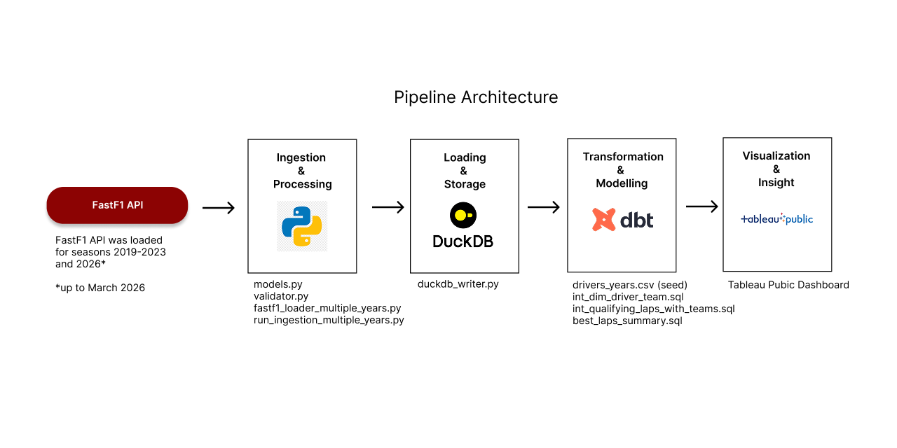
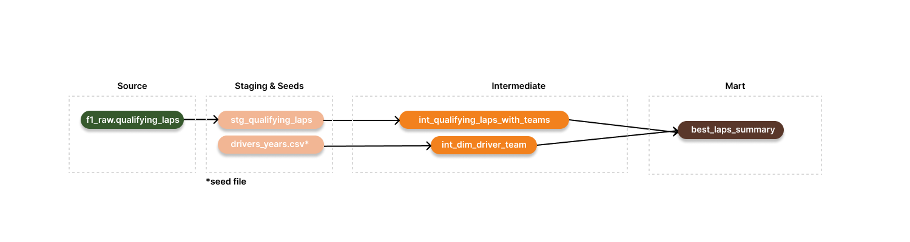
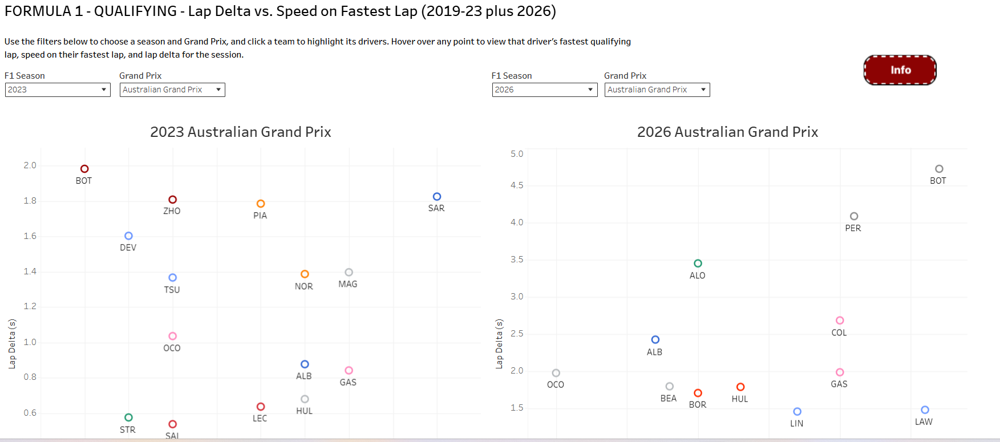

# Formula 1 Qualifying Analysis Dashboard  
*A complete end‑to‑end data engineering and analytics project using FastF1, Python, DuckDB, dbt, and Tableau.*

---

## 📌 Background & Overview

This project builds a full analytics engineering pipeline to analyze **Formula 1 qualifying performance** across seasons. The final output is an interactive **Tableau dashboard** that allows users to explore driver performance, compare fastest laps, and visualize speed vs lap‑time deltas for any Grand Prix for the following seasons: 2019, 2020, 2021, 2022, 2023, 2026 (up to Japanese GP).

The workflow integrates:

- **FastF1 API ingestion**  
- **Pydantic validation**  
- **DuckDB** as analytical storage  
- **dbt** for transformations, testing, and modeling  
- **Tableau** for final visualization  

The pipeline:

1. Ingests raw qualifying lap data from FastF1  
2. Validates and structures the data using Pydantic models  
3. Stores all raw and transformed data in DuckDB  
4. Uses dbt to clean, enrich, and compute fastest laps and deltas  
5. Produces a final dataset powering a Tableau dashboard  

---

## 🏗️ Pipeline Architecture

Full pipeline architecture:



The pipeline follows a clean, layered structure:

**FastF1 Ingestion → Pydantic Validation → DuckDB → dbt Staging → dbt Intermediate → dbt Marts → Tableau Dashboard**

---

## 📥 Ingestion Layer (Python + FastF1)

The ingestion layer retrieves raw qualifying lap data for all seasons included in the analysis.

### Key Features

- Uses **FastF1** to download session data  
- Extracts lap times, speeds, driver metadata, and session context  
- Applies **Pydantic validation** to ensure schema consistency  
- Writes validated data into DuckDB  

### Scripts

| Script | Purpose |
|--------|---------|
| `models.py` | Defines strict validation schemas for all ingested fields |
| `validator.py` | Validates each row of the qualifying DataFrame using the QualifyingLap model |
| `fastf1_loader_multiple_years.py` | Downloads qualifying sessions and extracts lap‑level data |
| `duckdb_writer.py` | Writes validated qualifying data into a DuckDB database |
| `run_ingestion_multiple_years.py` | Orchestrates ingestion + validation + loading into DuckDB |

All ingestion outputs are written into:

```
data/f1_qualifying.duckdb
```

---

## 🗄️ Storage Layer (DuckDB)

DuckDB is used as the analytical storage engine.  
It is:

- Fast  
- File‑based  
- Zero‑configuration  
- Ideal for local analytics and dbt workflows  

All raw and transformed tables live inside a single `.duckdb` file.

---

## 🧱 Transformation Layer (dbt)

dbt is responsible for cleaning, enriching, and modeling the qualifying data.

The project follows a **staging → intermediate → marts** structure.

Full dbt DAG lineage:



---

### 🧹 Staging Models

These models standardize and type raw FastF1 data:

- `stg_qualifying_laps.sql`  

They ensure:

- Clean column names  
- Correct data types  
- Removal of malformed rows  
- Consistent driver and track identifiers  

---

### 🔧 Intermediate Models

These models apply business logic and enrich the dataset.

Key transformations:

- Assign each driver to the correct team for each season  
- Compute fastest lap per driver per track  
- Compute pole time per session  
- Join speed, session, and driver metadata  
- Format lap times into FIA‑style `M:SS.mmm`  

All intermediate models listed below:

- `int_qualifying_laps_with_teams.sql`  
- `int_dim_driver_team.sql`  

The model `int_dim_driver_team.sql` is created from a seed file (drivers_years.csv) that maps each driver to a team in a specific year. That is because drivers can change team between seasons and some teams are re-branded between seasons too. 

---

### 📦 Marts

Final analysis‑ready tables used by Tableau:

- `best_laps_summary.sql`  

This table includes:

- Driver  
- Team  
- Year  
- Track  
- Fastest lap time  
- Formatted lap time  
- Speed on fastest lap  
- Lap delta vs pole  

---

## 🧪 dbt Tests (Full Detail)

This project includes a comprehensive suite of **generic** and **custom** tests to ensure data quality.

### Generic Tests

Applied across staging and intermediate layers:

- **not_null** on primary keys (driver, year, track, lap_time)  
- **unique** on `(driver, year, track)` in fastest‑lap models  
- **accepted_values** for session types (making sure it only accepts records with a 'Q')  

---

### Custom Tests

#### No duplicate rows on the raw laps  
This test will raise a warning in case duplicates are found in the raw data ingestion from fastf1

---

## 📊 Final Output — Tableau Dashboard

Link to the dashboard: 
https://public.tableau.com/app/profile/diogo4218/viz/Formula1Qualifying/Formula1-Qualifying





The final deliverable is an interactive Tableau dashboard that visualizes:

- Speed vs Lap Delta scatterplots  
- Fastest laps per driver  
- Team‑based colour coding  
- Session‑level comparisons  
- Year and Grand Prix filters  

### 🔍 How to interact with the dashboard

Users can:

- **Filter** by season and Grand Prix  
- **Click a team** to highlight its drivers  
- **Hover** over any point to view:  
  - Driver  
  - Team  
  - Fastest lap time  
  - Speed on fastest lap  
  - Lap delta vs pole  
- **Compare** driver performance across teams and seasons  
- **Explore** how speed correlates with lap‑time competitiveness  

The dashboard is designed to be intuitive, exploratory, and visually aligned with F1 analytics.

---

## 📊 Insights Summary

The analysis reveals:

- Relationships between **speed** and **lap delta**  
- Team performance differences across seasons  
- Driver consistency patterns  
- How qualifying competitiveness shifts across circuits  

The dashboard enables users to explore:

- Which drivers outperform their teammates  
- How car performance evolves year‑to‑year  
- Which tracks reward straight‑line speed vs cornering efficiency  

---

## 🐳 Environment & Dependency Management

### Docker  
Ensures reproducible execution of the entire pipeline.

### Poetry  
Manages Python dependencies and virtual environments.

Together, they provide a fully isolated and reproducible environment.

---

## 🛠️ Tools Used

### FastF1  
- Session ingestion  
- Lap‑level telemetry  
- Driver and team metadata  

### Pydantic  
- Strict validation of ingested data  
- Schema enforcement  

### DuckDB  
- Fast, file‑based OLAP engine  
- Perfect for local analytics  

### dbt  
- Staging, intermediate, and mart models  
- Custom tests  
- Documentation  
- DAG lineage visualization  

### Tableau  
- Final interactive dashboard  
- User‑friendly exploration of qualifying performance  

---

## 🚀 Areas for Improvement

1. **Add more seasons**  
2. **Include race‑pace analysis**  
3. **Add tyre compound and weather data**  
4. **Enhance team‑colour mapping**  
5. **Add driver photos and team logos to the dashboard**  

---

## 🙏 Credits & Learning Resources

This project was inspired by:

- **FastF1 documentation**  
- **An analysis of the Bahrain GP 2022 from a former Red Bull engineer**
    - https://youtu.be/2PUz2EvbHRw?si=SGlCd1OuQqrpiuQe