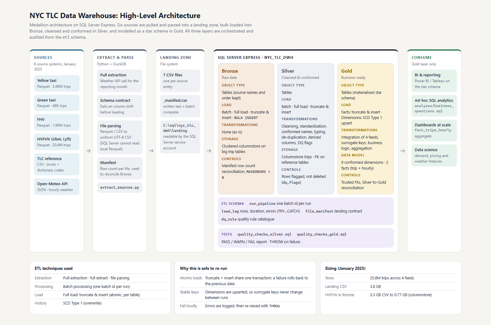
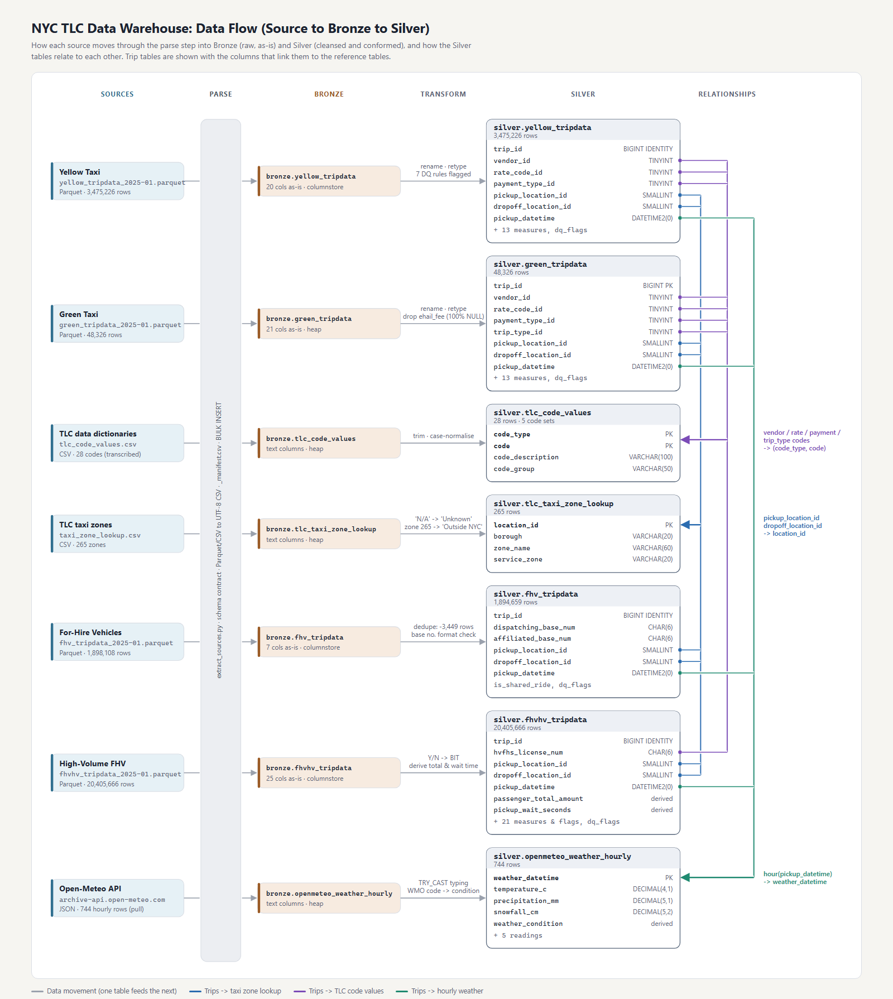
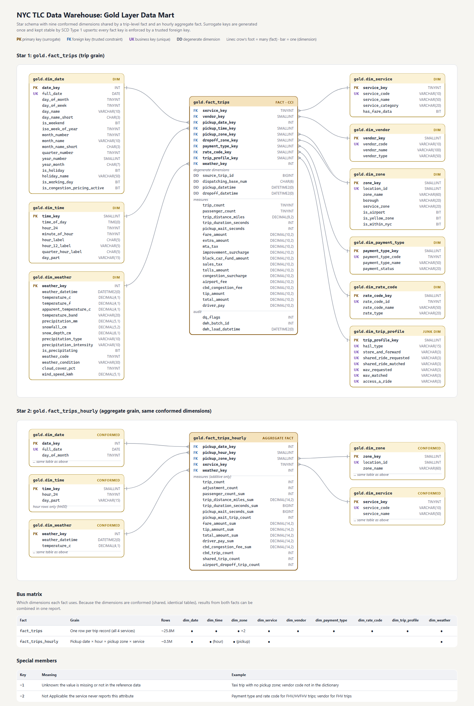

# NYC Taxi & Limousine Data Warehouse

A SQL Server data warehouse, built from scratch on the **NYC Taxi & Limousine Commission (TLC) trip records**. It integrates four independent trip feeds (**yellow taxi, green taxi, FHV and high-volume FHV/Uber-Lyft**), TLC reference data and an **external hourly weather source** into one star schema, using a Bronze / Silver / Gold medallion architecture.

The data is one month (January 2025): **25.8 million trips**. That month is also when New York introduced **congestion pricing** (5 Jan 2025), which the model supports directly.

---

## 🏗️ Data Architecture



> Interactive versions (light/dark mode): [architecture](docs/data_architecture.html) · [data flow](docs/data_flow.html) · [data model](docs/data_model.html). Open them in a browser.

| Layer | What it holds | Object type | Load | Transformations | Storage |
|---|---|---|---|---|---|
| **Bronze** | Raw data, exactly as delivered (source column names and order) | Tables | Batch · full load · truncate & insert · `BULK INSERT` | None | Clustered columnstore for large trip tables |
| **Silver** | Cleansed, standardised, **conformed** data plus data-quality flags | Tables | Batch · full load · truncate & insert | Cleansing, standardisation, typing, de-duplication, derived columns, enrichment | Columnstore trips, PKs on reference tables |
| **Gold** | Business-ready **star schema** | Tables | Facts: truncate & insert · Dimensions: **SCD Type 1** upsert | Integration of 4 feeds, surrogate keys, business rules, aggregation | Columnstore fact, rowstore aggregate fact, B-tree dims |

The pipeline is controlled from an `etl` schema (batch ids, load log, landing manifest, data-quality rule catalogue) and validated by `tests/`.

---

## 📖 Project Overview

This project covers:

1. **Data architecture**: a medallion warehouse sized for SQL Server Express (columnstore compression keeps 25.8M rows × 3 layers well within the Express database limit).
2. **ETL pipelines**: pull extraction (weather API), file parsing (Parquet → CSV, because SQL Server cannot read local Parquet), batch full loads with atomic truncate-and-insert, SCD Type 1 dimensions.
3. **Data quality engineering**: schema-drift detection, manifest row-count reconciliation, a rule catalogue with REJECT/WARN severities, flag-don't-delete Silver, and automated PASS/WARN/FAIL test suites.
4. **Data modelling**: nine conformed dimensions (including a junk dimension, role-playing zone dimension, generated date/time dimensions and an external weather dimension) shared by a trip-level fact and an hourly aggregate fact.
5. **Analytics**: example business questions in [`analyses/business_questions.sql`](analyses/business_questions.sql): congestion-pricing impact, market share, weather impact on demand and wait times, rideshare driver share.

### Data flow (Source → Bronze → Silver)



### Data model (Gold star schema)



### ETL techniques used

| Technique | Where |
|---|---|
| **Pull extraction** | `extract_sources.py` calls the Open-Meteo API for the reporting month |
| **Full extraction** | Whole monthly files are extracted every run |
| **File parsing** | Parquet and CSV are parsed into a uniform UTF-8 CSV landing format; schema contracts are validated |
| **All transformations** | Cleansing, standardisation, normalisation, derived columns, enrichment, integration, business rules, aggregation (see [Silver](scripts/silver/proc_load_silver.sql) and [Gold](scripts/gold/proc_load_gold.sql)) |
| **Batch processing** | One `batch_id` per run, stamped on every row and every log entry |
| **Full load (truncate & insert)** | Bronze, Silver and Gold facts, each table in one transaction |
| **SCD Type 1** | Gold dimensions are upserted (overwrite in place, stable surrogate keys) |

---

## 🧩 Design Decisions

The choices a reviewer is most likely to ask about, and why they were made.

| Decision | Reasoning |
|---|---|
| **One month of data** | The goal is to demonstrate warehouse design, not volume. One month is still 25.8M rows, which is enough to make indexing, compression and load design matter. Everything is parameterised by reporting month, so more months need no code change. |
| **Python parsing step before Bronze** | SQL Server's `OPENROWSET(FORMAT='PARQUET')` only reads object storage, not local files (verified on SQL Server 2025). DuckDB streams Parquet to CSV with capped memory (~35 s for all files). |
| **Bronze typed from Parquet, text from CSV** | Parquet is self-describing, so equivalent SQL types lose nothing. CSV/API sources land as VARCHAR and are typed in Silver with `TRY_CAST`. |
| **Flag, don't delete, in Silver** | Every trip gets a `dq_flags` bitmask. Silver still reconciles 1:1 with Bronze, Gold filters on REJECT-severity rules, and analysts can still study WARN rows. The only rows removed are exact duplicates. |
| **Reversals counted as 0 trips** | About 63K yellow rows are negative-total reversals of an earlier trip. They stay in the fact so revenue nets correctly, but with `trip_count = 0` so trip volumes are not double counted. |
| **Gold as tables, not views** | Views would re-union 25M rows and re-resolve eight surrogate keys on every query. Tables give stable surrogate keys, indexes, PK/FK/CHECK constraints and an aggregate fact. |
| **SCD Type 1 via UPDATE + INSERT** | Foreign keys block `TRUNCATE` on dimensions, and re-inserting would re-number keys. Explicit UPDATE/INSERT avoids known `MERGE` issues with filtered indexes. Change detection uses the NULL-safe `EXISTS (... EXCEPT ...)` pattern. |
| **Special members -1 / -2** | Facts never hold NULL keys. "Unknown" (missing value) is reported separately from "Not Applicable" (e.g. payment type for FHV). |
| **Junk dimension** | Seven Yes/No/N-A trip flags become one 2,187-row dimension and one key, instead of seven keys or text columns in a 25M-row fact. |
| **Degenerate dimension for base number** | No base names are available, so a `dim_base` would only hold its own key. |
| **Constraints only where the data supports them** | Examples: no PK on Silver trip tables (no natural key exists), no UNIQUE on `zone_name` (TLC reuses names), a filtered UNIQUE index on business keys so the special members can share NULL. |
| **Indexing for scale** | Columnstore for scan-heavy trip tables (the 3.3 GB HVFHV CSV is stored in 0.77 GB), rowstore with a clustered PK for the aggregate fact and dimensions, and no non-clustered indexes on the fact (there is no point-lookup workload). Monthly partitioning is the documented next step once several months are loaded. |
| **External data: weather** | The Open-Meteo Historical Weather API is free, needs no key, and its hourly grain matches taxi demand. It enables questions like "does snow increase HVFHV wait times?" |

---

## 🛠️ Important Links & Tools

- **[NYC TLC Trip Record Data](https://www.nyc.gov/site/tlc/about/tlc-trip-record-data.page)**: source trip files and data dictionaries.
- **[Open-Meteo Historical Weather API](https://open-meteo.com/en/docs/historical-weather-api)**: external weather source (CC BY 4.0).
- **[SQL Server Express](https://www.microsoft.com/en-us/sql-server/sql-server-downloads)**: tested on SQL Server 2025 Express (17.0).
- **[SQL Server Management Studio (SSMS)](https://learn.microsoft.com/en-us/sql/ssms/download-sql-server-management-studio-ssms)**: to run the scripts.
- **[Python 3.10+](https://www.python.org/)** with **[DuckDB](https://duckdb.org/)**: the parsing step (`pip install -r requirements.txt`).

---

## 🚀 Project Requirements

### Building the Data Warehouse (Data Engineering)

#### Objective
Build a SQL Server data warehouse that consolidates the NYC for-hire transport market (taxis and app-based services) into one analytical model, to support reporting on demand, pricing, market share and service quality.

#### Specifications
- **Data sources**: four TLC trip feeds (Parquet), TLC zone lookup and data-dictionary codes (CSV), and hourly weather (API). Each is treated as a separate source system.
- **Data quality**: detect and resolve quality issues before analysis, keeping the evidence and making every exclusion traceable.
- **Integration**: conform the four feeds, which have different schemas, into a single star schema.
- **Scope**: one reporting month (January 2025); no history is kept (SCD Type 1).
- **Documentation**: data catalogue, naming conventions, architecture, data flow and data model diagrams.

### BI: Analytics & Reporting

Answer business questions such as:
- **Market share**: taxis vs. Uber/Lyft by borough and time of day.
- **Congestion pricing**: share of trips charged the CBD toll, and how demand changed after 5 Jan 2025.
- **Weather**: demand and rideshare wait times under snow, rain and freezing temperatures.
- **Economics**: tipping behaviour by payment type, and driver pay as a share of rider spend.

---

## ▶️ How to Run

**Prerequisites**: SQL Server (Express is enough), SSMS, Python 3.10+.

1. **Get the data.** Put the four January 2025 Parquet files in `datasets/source_tlc/` (see [`datasets/README.md`](datasets/README.md)).
2. **Extract & parse** into a landing folder the SQL Server service account can read (for example `C:\sql\...`; folders under `C:\Users\<you>\Documents` usually are **not** readable by it):
   ```bash
   pip install -r requirements.txt
   python scripts/extract/extract_sources.py --landing-dir "C:\sql\nyc_tlc_dwh\landing"
   ```
3. **Deploy the database objects** in SSMS, in this order:

   | # | Script | Creates |
   |---|---|---|
   | 1 | `scripts/init_database.sql` | Database `nyc_tlc_dwh` and schemas (**drops it if it exists**) |
   | 2 | `scripts/etl/ddl_etl.sql` | Load log, manifest, DQ rule catalogue |
   | 3 | `scripts/bronze/ddl_bronze.sql` | Bronze tables |
   | 4 | `scripts/bronze/proc_load_bronze.sql` | `bronze.load_bronze` |
   | 5 | `scripts/silver/ddl_silver.sql` | Silver tables |
   | 6 | `scripts/silver/proc_load_silver.sql` | `silver.load_silver` |
   | 7 | `scripts/gold/ddl_gold.sql` | Gold star schema |
   | 8 | `scripts/gold/proc_load_gold.sql` | `gold.load_gold` |
   | 9 | `scripts/etl/proc_run_pipeline.sql` | `etl.run_pipeline` |

4. **Run the pipeline** (about 25 minutes on a laptop with SQL Server Express):
   ```sql
   EXEC etl.run_pipeline @landing_path = N'C:\sql\nyc_tlc_dwh\landing\';

   -- What happened in the last run:
   SELECT * FROM etl.load_log
   WHERE batch_id = (SELECT MAX(batch_id) FROM etl.load_log)
   ORDER BY load_log_id;
   ```
   Each layer can also be run on its own: `EXEC bronze.load_bronze;`, `EXEC silver.load_silver;`, `EXEC gold.load_gold;`.
5. **Validate**: run `tests/quality_checks_silver.sql` and `tests/quality_checks_gold.sql`. Each returns a PASS/WARN/FAIL report and raises an error if any check fails.
6. **Explore**: `analyses/business_questions.sql`.

---

## 📂 Repository Structure

```
nyc-sql-server-data-warehouse/
│
├── datasets/
│   ├── source_tlc/                  # TLC trip Parquet files (not in Git: download, see datasets/README.md)
│   ├── source_reference/            # taxi_zone_lookup.csv, tlc_code_values.csv (codes from the data dictionaries)
│   ├── source_weather/              # hourly weather pulled from Open-Meteo
│   └── README.md                    # where each dataset comes from, licences
│
├── docs/
│   ├── images/                      # PNG renders of the three diagrams (for GitHub)
│   ├── data_architecture.html       # high-level architecture
│   ├── data_flow.html               # source → bronze → silver lineage and Silver table relationships
│   ├── data_model.html              # Gold star schemas, bus matrix
│   ├── data_catalog.md              # every Gold and Silver column, source mapping, DQ rules
│   └── naming_conventions.md        # naming rules for schemas, tables, columns, constraints, procedures
│
├── scripts/
│   ├── extract/extract_sources.py   # pull + parse sources into the landing zone, write the manifest
│   ├── init_database.sql            # database + schemas
│   ├── etl/                         # control objects (log, manifest, DQ rules) and etl.run_pipeline
│   ├── bronze/                      # DDL + load procedure (BULK INSERT)
│   ├── silver/                      # DDL + load procedure (cleansing, conforming, DQ flags)
│   └── gold/                        # DDL + load procedure (star schema, SCD1, facts)
│
├── tests/
│   ├── quality_checks_silver.sql    # reconciliation, validity, standardisation, thresholds
│   └── quality_checks_gold.sql      # FK trust, Silver→Gold reconciliation, special members
│
├── analyses/
│   └── business_questions.sql       # example analytical queries on the star schema
│
├── requirements.txt
├── .gitignore
├── LICENSE                          # MIT
└── README.md
```

---

## 📊 Results of a Full Run (January 2025)

Measured on a laptop running SQL Server 2025 Express (`EXEC etl.run_pipeline`).

| Layer | Rows | Load time | Storage |
|---|---|---|---|
| Landing (CSV) | 25.8M trips + reference | 35 s (Python) | 3.8 GB |
| Bronze | 25,827,326 trips | 6 min | 0.89 GB |
| Silver | 25,823,877 trips (3,449 duplicates removed) | 6 min | 1.09 GB |
| Gold | `fact_trips` 25,823,016 · `fact_trips_hourly` 401,078 | 13 min | 0.94 GB |

All three layers together (2.9 GB) take less space than one copy of the raw CSV, thanks to columnstore compression.

**Quality checks:** Silver 43 PASS / 1 WARN · Gold 31 PASS / 2 WARN · 0 FAIL. Money reconciles to the cent from Bronze to Silver to Gold, and the hourly aggregate matches the detail fact exactly. The WARNs are known properties of the data: 83% of FHV trips have no pickup zone, and 4 trips were charged the congestion toll with a dropoff before go-live.

**What the model shows** (from `analyses/business_questions.sql`, all 8 queries run in about 6 s):
- **Congestion pricing:** after 5 Jan, **73%** of yellow-taxi trips and **35%** of Uber/Lyft trips were charged the Congestion Relief Zone toll: **$11.1M** in 27 days across the two.
- **Market share:** Uber and Lyft carry **71%** of Manhattan pickups and **92-99%** in the outer boroughs.
- **Driver economics:** Uber drivers receive **52%** of what the rider pays in Manhattan, against **75%** in the Bronx.
- **Weather:** HVFHV wait times rise from about 4.4 to 5.5 minutes in freezing snow hours.
- **Data finding:** about 1,600 trips were charged the toll before go-live; they were picked up on 4 Jan and entered the zone after midnight.

---

## 🛡️ License

The code in this project is licensed under the MIT License. TLC data is published by the NYC Taxi & Limousine Commission via NYC Open Data. Weather data by [Open-Meteo.com](https://open-meteo.com/), licensed under CC BY 4.0.
